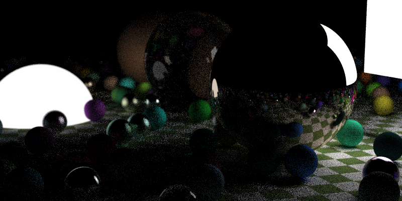

# tinytrace

Following [Ray Tracing in a Weekend](http://in1weekend.blogspot.com/2016/01/ray-tracing-in-one-weekend.html),
which is a delight so far, even without any actual rays being properly traced!

Use `./scripts/run` to make this compile and run automatically.  (And open the
result in an image viewer.  It's quite the nice workflow.)

## Results

### Summary

| State         | Description | Resolution | Render time        |
|---------------|-------------|------------|--------------------|
| in a weekend  |             | 3840x2160  | 1788251ms (29m48s) |

### In a ~weekend

After a little more than a weekend (with quite a few excursions for workflow improvements),
I rendered this 4K (3840x2160px) image:

