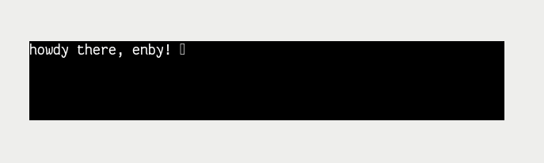

# hello\_sdl

While reading [Things Unlearned](https://scattered-thoughts.net/writing/things-unlearned)
by Jamie Brandon recently, I happened upon this paragraph:

> I definitely feel I've gotten better at this. When I wanted to write a
> text editor last year I spent a few days learning the absolute basics
> of graphics programming and text rendering, used mostly mainstream
> tools like sdl and freetype, and then just sat down and shoveled
> through a long todo list. In the end it only took 100 hours or so,
> much less time than I spent thrashing on that note-taking app a decade
> ago. And now I get to use my text editor all the time.

And then I proceeded to render some text using SDL + FreeType.  It took
2 or 3 hours, never having used SDL _or_ FreeType.  That includes
debugging various string-related segfaults in C.  (Don't write to
statically allocated `char *msg = "...";` and don't use `strcmp` with
NULL pointers.)

It was fun!  And hence, this little thing.  You can even type something
yourself.

This is how it looks after those initial few hours:



And for everything else, see [`hello_sdl.c`](./hello_sdl.c).  To run it
compile it by running make `make` and then run `./hello_sdl`.  Do note
that you'll need a TTF font from somewhere and then run it like this:

```
./hello_sdl /usr/share/fonts/TTF/DejaVuSerif.ttf
```

By default it wants `./FantasqueSansMono-Regular.ttf`, which you can get
from the `ttf-fantasque-sans-mono` package on ArchLinux.

See [../../zig/sdl](../../zig/sdl) for continued experiments!
